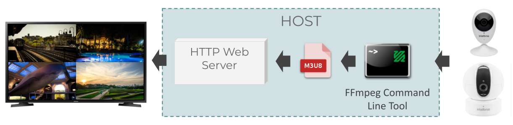

# [Eyes](https://github.com/jon-cbar/eyes/)

 

## Context, Problem and Solution

I have some iC3 and iC4 [Intelbras](https://intelbras.com/en) Mibo IP cameras.
Intelbras makes a mobile application available for [Android](https://play.google.com/store/apps/details?id=com.intelbras) and [iPhone](https://apps.apple.com/app/mibo/id1221971306) to access the cameras using its private cloud.
It works, but I wanted to go further.
I needed to watch my cameras on the Smart TV, without using a Digital Video Recorder (DVR) for that.

Well, I decided to run a web server and access the cameras through the TV browser.
I believed it would be more useful than creating an application for Smart TV, as it could also access the cameras on my computer.
The default camera protocol is [Real-Time Streaming Protocol (RTSP)](https://en.wikipedia.org/wiki/Real_Time_Streaming_Protocol), but I needed to use [HTTP Live Streaming (HLS)](https://en.wikipedia.org/wiki/HTTP_Live_Streaming) to access via a web browser.

Then, I had two things to do:

1. Translate, for each camera, RTSP streaming into an HLS streaming; and
2. Run a web server to make the videos available.

I realized that I can make this easy with [Python](https://www.python.org/) and [FFmpeg](https://www.ffmpeg.org/).

## Architecture



### Technologies

- [Python](https://www.python.org/)
- [FFmpeg](https://www.ffmpeg.org/)
- [HTML](https://developer.mozilla.org/docs/Web/HTML)
- [JavaScript](https://developer.mozilla.org/en-US/docs/Web/JavaScript)
- [CSS](https://developer.mozilla.org/en-US/docs/Web/CSS)

### Python

Python is a versatile programming language.
It has its limitations but also delivers a lot of things ready at a very low computational cost.
For example, I can start a web server and run commands on the operating system in parallel, using subprocesses and multiprocessing.

#### Web Server

To start a web server, I used the [`http.server`](https://docs.python.org/3/library/http.server.html) module.
As mentioned in the documentation, it is not recommended for use in a production environment, because of resource limitations that ensure better application security.
For my case, with use in the home environment, it meets.

#### Concurrent Execution

> [`multiprocessing`](https://docs.python.org/3/library/multiprocessing.html) package offers concurrency, using subprocesses instead of threads. Due to this, the multiprocessing module allows the programmer to fully leverage multiple processors on a given machine.

### FFmpeg

FFmpeg is a cross-platform video and audio converter.
It has a command-line tool that makes it easy to convert between [different protocols](http://ffmpeg.org/ffmpeg-protocols.html).
For example, to translate an RTSP streaming provided by an IP Camera (`192.168.1.2`) into an HLS streaming, you can use this:

```sh
ffmpeg -i rtsp://192.168.1.2/live/mpeg4 playlist.m3u8
```


### Workflow (Start Script)

- Defines some constants, like `SERVER_PORT`, `MEDIA_DIRECTORY` and `RTSP_PORT`.
- Gets OS environment variables: `IP_CAMERA_USER` and `IP_CAMERA_PASSWORD`.
- Sets the log level: info is the default.
- Cleans media directory: there, the playlists (`.m3u8`) and video segments (`.ts`) of each camera will be stored.
- Looks for IP cameras running in the network.
- Creates workers to start:
  - an HTTP Web Server; and
  - HLS Streaming cameras. For each camera:
    - Creates a random ID.
    - Includes camera to HTML index file.
- Starts OS subprocesses from created workers.

## How to Use

I coded and tested it on [Ubuntu 20.04.2 LTS](https://ubuntu.com/download/desktop).

### 1. Git, Python and FFmpeg

Make sure that you have [Git](https://git-scm.com/downloads), [Python3](https://www.python.org/about/gettingstarted/), and [FFmpeg](https://www.ffmpeg.org/download.html) installed.
OS Environment Variables

To install them on Ubuntu, do the following:

```sh
sudo apt-get update
sudo apt-get upgrade
sudo apt-get install git
git --version
sudo apt-get install python3
python3 --version
sudo apt-get install ffmpeg
ffmpeg -version
```

I used:
- Git 2.25.1
- Python 3.8.5
- FFmpeg 4.2.4-1ubuntu0.1.

### 2. OS Environment Variables

To make my life easier, I kept all the cameras with the same username and password. 
Then, since user and password are sensitives data, they must be set as OS environment variables (`IP_CAMERA_USER` and `IP_CAMERA_PASSWORD`), instead of being fixed in the code.

On Ubuntu, it is possible to add in `/etc/environment` file:

```sh
echo "IP_CAMERA_USER=username" | sudo tee -a /etc/environment
echo "IP_CAMERA_PASSWORD=password" | sudo tee -a /etc/environment
```
Restart the operating system.

### 3. Clone this repository

```sh
git clone https://github.com/jon-cbar/eyes.git
```

### 4. Start it

The web server requires it to run as a superuser. 

```sh
cd eyes
sudo python3 start.py
```

Then, open `http://{your-local-ip}` with your browser to see the result.
